<!-- Generated by scripts/update_profile.py. Edit .profile/README.template.md instead. -->

  <a href="https://likeyy.love"><picture>
    <source media="(max-width: 600px)" srcset="assets/hero-mobile.svg" />
    
  </picture></a>

  <a href="https://likeyy.love"><strong>寒森博客 ↗</strong></a> &nbsp; / &nbsp;
  <a href="https://github.com/Hanserwei?tab=repositories"><strong>全部项目</strong></a> &nbsp; / &nbsp;
  <a href="mailto:hanserwei@qq.com"><strong>联系我</strong></a> &nbsp; / &nbsp;
  <a href="https://likeyy.love/rss.xml"><strong>订阅 RSS</strong></a>

 

### 你好，我是寒森。 BUILD · MEASURE · LEARN

在成都写后端，也折腾开源工具和自己的 Homelab。主要使用 **Java / Spring** 构建服务，用 **Rust** 打磨工具，用 **Python** 做实验。最近在探索 DDD、数据库性能，以及 AI Agent 的上下文与工程实践。

喜欢把「应该可以」变成**可运行的代码、可复现的实验、可以读懂的笔记**。这里是我的工作台，博客是它的另一面。

  <picture>
    <source media="(max-width: 600px)" srcset="assets/generated/pulse-mobile.svg" />
    
  </picture>

 

### 01 / 精选作品 SELECTED BUILDS

从业务系统到终端工具，从数据库深处到家里的服务器。

<a href="https://github.com/Hanserwei/han-menu">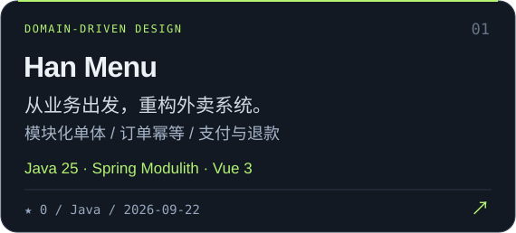</a>
<a href="https://github.com/Hanserwei/hanserwei-springboot-ddd">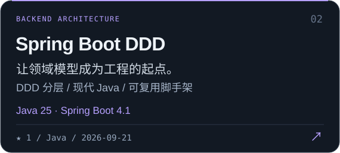</a>
<a href="https://github.com/Hanserwei/mysql-single-table-bench">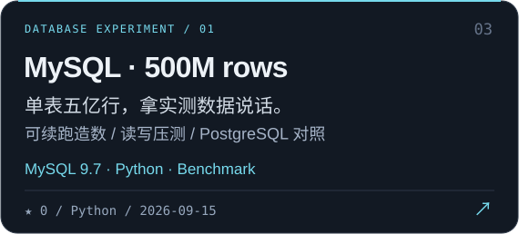</a>
<a href="https://github.com/Hanserwei/pg-single-table-bench">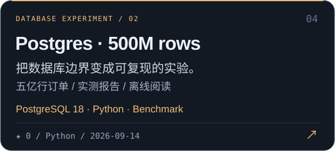</a>
<a href="https://github.com/Hanserwei/podman-tui">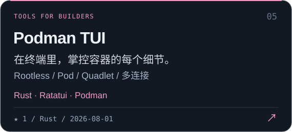</a>
<a href="https://github.com/Hanserwei/tailscale-home-services">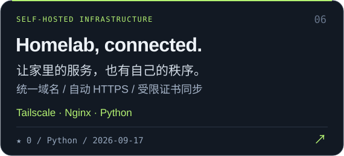</a>

查看项目文字索引

- **[Han Menu](https://github.com/Hanserwei/han-menu)** — 从业务出发，重构外卖系统。 模块化单体 / 订单幂等 / 支付与退款 `Java 25 · Spring Modulith · Vue 3`
- **[Spring Boot DDD](https://github.com/Hanserwei/hanserwei-springboot-ddd)** — 让领域模型成为工程的起点。 DDD 分层 / 现代 Java / 可复用脚手架 `Java 25 · Spring Boot 4.1`
- **[MySQL · 500M rows](https://github.com/Hanserwei/mysql-single-table-bench)** — 单表五亿行，拿实测数据说话。 可续跑造数 / 读写压测 / PostgreSQL 对照 `MySQL 9.7 · Python · Benchmark`
- **[Postgres · 500M rows](https://github.com/Hanserwei/pg-single-table-bench)** — 把数据库边界变成可复现的实验。 五亿行订单 / 实测报告 / 离线阅读 `PostgreSQL 18 · Python · Benchmark`
- **[Podman TUI](https://github.com/Hanserwei/podman-tui)** — 在终端里，掌控容器的每个细节。 Rootless / Pod / Quadlet / 多连接 `Rust · Ratatui · Podman`
- **[Homelab, connected.](https://github.com/Hanserwei/tailscale-home-services)** — 让家里的服务，也有自己的秩序。 统一域名 / 自动 HTTPS / 受限证书同步 `Tailscale · Nginx · Python`

 

### 02 / 最近在写 ON THE WORKBENCH

<a href="https://github.com/Hanserwei/hanlo-theme"><strong>hanlo-theme ↗</strong></a> &nbsp; HTML · 2026-09-24 halo-theme-hao 独立维护版本

<a href="https://github.com/Hanserwei/han-menu"><strong>han-menu ↗</strong></a> &nbsp; Java · 2026-09-22 外卖业务 DDD 模块化单体：Java 25 / Spring Boot 后端与 Vue 3 管理端，支持 Podman 本机部署。

<a href="https://github.com/Hanserwei/hanserwei-springboot-ddd"><strong>hanserwei-springboot-ddd ↗</strong></a> &nbsp; Java · 2026-09-21 Spring Boot 4.1 and JDK 25 DDD scaffold

<a href="https://github.com/Hanserwei/tailscale-home-services"><strong>tailscale-home-services ↗</strong></a> &nbsp; Python · 2026-09-17 Tailscale 家庭服务统一域名与自动 HTTPS：DNSPod DNS-01、Nginx 双地址反向代理、受限 SSH 证书同步及 systemd 定时任务。

 

### 03 / 代码之外，写下来 NOTES FROM THE LAB

在 **[寒森博客 · likeyy.love](https://likeyy.love)** 记录工程实践、踩坑过程和生活。下面是最近发布的文章：

2026-09-22 <a href="https://likeyy.love/archives/han-menu-01-ddd-modulith"><strong>从零重构外卖系统（一）：先理解业务，再用 Spring Modulith 搭建 DDD 骨架 ↗</strong></a>

2026-09-22 <a href="https://likeyy.love/archives/han-menu-02-employee-identity"><strong>从零重构外卖系统（二）：把员工账号规则落地为领域模型、JPA 和 REST API ↗</strong></a>

2026-09-22 <a href="https://likeyy.love/archives/han-menu-03-catalog-consistency"><strong>从零重构外卖系统（三）：商品、套餐与营业状态，怎样从 CRUD 走向业务建模 ↗</strong></a>

2026-09-22 <a href="https://likeyy.love/archives/han-menu-04-customer-cart"><strong>从零重构外卖系统（四）：顾客身份、默认地址与购物车，怎样设计归属和一致性 ↗</strong></a>

2026-09-22 <a href="https://likeyy.love/archives/han-menu-05-order-idempotency"><strong>从零重构外卖系统（五）：订单快照、幂等提交与购物车结算，怎样保证一次下单只发生一次 ↗</strong></a>

**[去博客继续阅读 ↗](https://likeyy.love)** &nbsp; · &nbsp; [RSS 订阅](https://likeyy.love/rss.xml)

 

### 04 / 常用装备 MY TOOLBOX

<a href="https://dev.java/">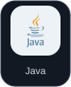</a>
<a href="https://www.postgresql.org/">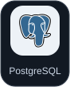</a>

<a href="https://redis.io/">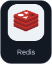</a>
<a href="https://www.rust-lang.org/">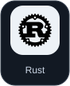</a>
<a href="https://www.python.org/">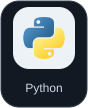</a>
<a href="https://podman.io/">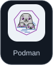</a>
<a href="https://git-scm.com/">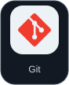</a>

  Java / Spring · SQL / Cache · Rust / Python · Containers / Homelab

 

### 05 / 一点一滴 THE COMMIT TRAIL

  

  <strong>Keep building. Stay curious.</strong> 
  在代码与生活之间，保持好奇。

---

  项目与文章内容更新于 2026-09-25 19:40 CST (UTC+8) · <a href="https://github.com/Hanserwei/Hanserwei/actions/workflows/update-profile.yml">每日自动同步</a> 
  Icons from <a href="https://dashboardicons.com/">Dashboard Icons</a> · <a href="docs/PROFILE.md">关于这个主页</a>

